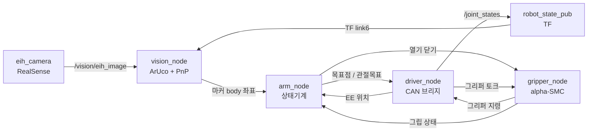

# piper_ws — PiPER 6축 로봇팔 마커 기반 Pick & Place

ArUco 마커로 물체를 찾아 집고, 다른 마커가 붙은 선반에 내려놓는 ROS 2 워크스페이스.
Jetson Orin Nano에서 실제 PiPER 팔을 CAN으로 직접 구동한다.

- **로봇** AgileX PiPER 6축 + 2지 그리퍼
- **센서** RealSense D455 (손목 장착, eye-in-hand)
- **환경** ROS 2 Humble / Ubuntu 22.04 (Jetson Orin Nano)
- **동작** 픽 마커 검출 → 접근 → 파지 → 리프트 → 파지 검증 → 플레이스 마커 검출 → 배치

전체 시퀀스를 사람 개입 없이 완주한다.

---

## 노드 구성과 데이터 흐름



| 노드 | 패키지 | 역할 |
|---|---|---|
| `arm_node` | `control_pkg` | phase 상태기계 — 전체 시퀀스를 지휘한다 |
| `vision_node` | `vision_pkg` | ArUco 검출 → solvePnP → 게이트 → 몸체좌표 발행 |
| `piper_driver_node` | `piper_hw_pkg` | CAN 브리지 — ROS 목표를 PiPER SDK 명령으로 |
| `piper_gripper_node` | `piper_hw_pkg` | 그리퍼 힘제어 (α-SMC) |
| `piper_eih_camera_node` | `piper_hw_pkg` | RealSense 스트림 + `link6→eih_cam` TF |
| `piper_fake_amr_node` | `piper_hw_pkg` | AMR 없는 구성의 스텁 — 개시 신호와 `body_link` TF |
| `robot_state_publisher` | — | URDF 기반 링크 TF |

---


## 빌드

```bash
git clone git@github.com:DH-LDH/piper_ws.git
cd piper_ws
source /opt/ros/humble/setup.bash
colcon build --symlink-install
source install/setup.bash
```

`piper_sdk`, `pyrealsense2`는 rosdep 키가 없어 별도 설치가 필요하다.

```bash
pip3 install piper_sdk python-can pyrealsense2
```

## 실행

CAN 인터페이스를 먼저 올린다(udev로 `can_piper`라는 이름에 고정해 둔다 — `can0`은 부팅마다 순서가 바뀐다).

```bash
sudo ip link set can_piper up type can bitrate 1000000
```

```bash
# 팔을 움직이지 않고 인식만 확인 (안전)
ros2 launch piper_hw_pkg piper_real.launch.py

# 실제 구동
ros2 launch piper_hw_pkg piper_real.launch.py really_enable:=true move_spd_rate_ctrl:=5
```

`really_enable`은 기본값이 `false`다. 빼면 CAN 연결과 피드백만 하고 모션 명령은 나가지 않는다.

**단계별로 멈춰가며 보려면** `step_confirm:=true`를 주고, 별도 터미널에서 `python3 step_confirm.py`를 띄워 Enter로 한 단계씩 진행한다.

### 자주 쓰는 인자

| 인자 | 기본값 | 의미 |
|---|---|---|
| `really_enable` | `false` | 실제 모션 명령 송신 여부 |
| `move_spd_rate_ctrl` | `5` | 팔 속도 [%] |
| `step_confirm` | `false` | 단계마다 수동 승인 대기 |
| `eih_pick_marker_id` | `0` | 픽 대상 마커 ID (34mm) |
| `eih_place_marker_id` | `3` | 플레이스 선반 마커 ID (34mm) |
| `arm` | `true` | `false`면 `arm_node`를 띄우지 않아 관절을 직접 지령할 수 있다 |

전체 목록은 `ros2 launch piper_hw_pkg piper_real.launch.py --show-args`.

---

## 보조 도구

| 스크립트 | 용도 |
|---|---|
| `read_arm_joint.py` | 현재 관절각 읽기 |
| `set_arm_joint.py` | 관절각 직접 지령 (IK·간섭검사 없음) |
| `step_confirm.py` | 단계별 진행 승인 |
| `eih_cam_calib.py` | 손목캠 외부파라미터 캘리브레이션 |
| `clear_arm_fault.py` | `TARGET_POS_EXCEEDS_LIMIT` 등 fault 복구 |

> **안전** — 팔을 활성화하는 모든 시점(기동, fault 복구, 프로세스 재시작)에 인에이블 직후 짧게 토크가 빠져 팔이 처지는 현상이 있다(브레이크 없는 축 추정). **반드시 팔을 손으로 받치고 시작할 것.**

---

## 참고용

**[docs/CODE_WALKTHROUGH.md](docs/CODE_WALKTHROUGH.md)** — 제어 알고리즘, 그리핑, 마커 검출을 코드 위치와 함께 설명한다. 상태기계 전이, α-SMC 제어칙, 평면 마커의 자세 이중해, 재투영 오차 게이트, 파지점 유도 같은 것들을 다룬다.


