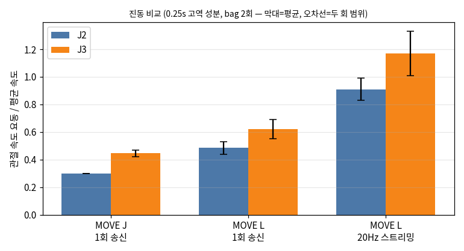
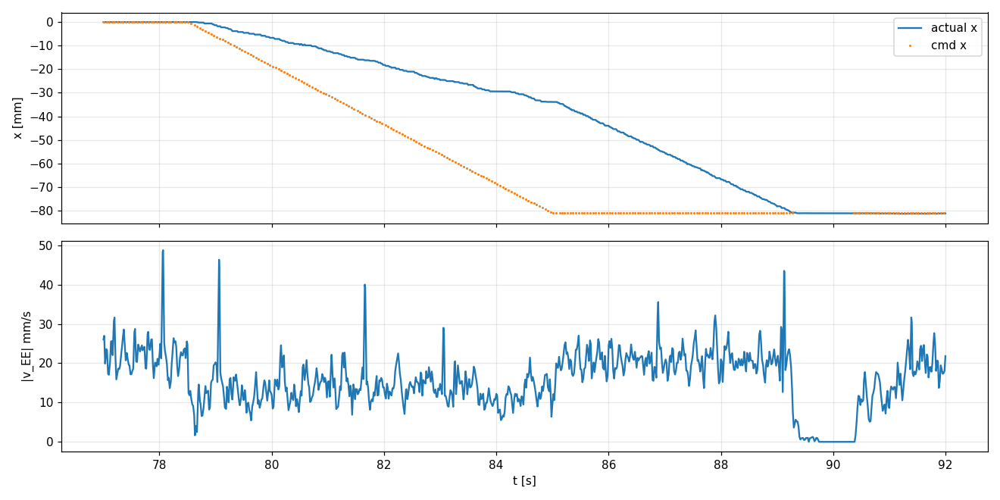
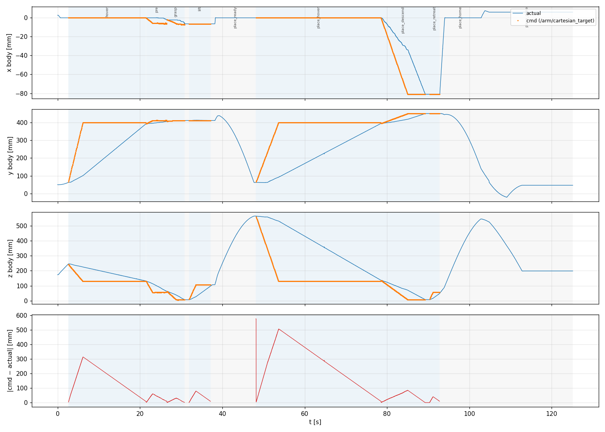
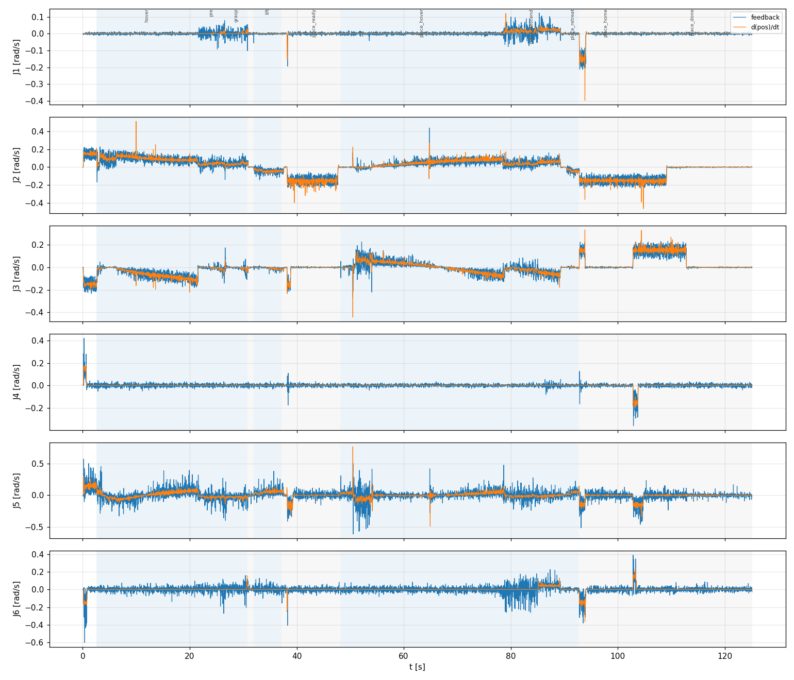

# A단계 보고 — 계측과 분석 (팔 + 비전)

2026-10-01 · 베이스 고정 · 팔 단독 pick&place

**요약.** 팔이 끊기고 떨리는 주원인은 비전 주기가 아니라, **펌웨어 MOVE L에 목표를 20 Hz로 흘려보내는 구조**다.
새 목표가 올 때마다 펌웨어가 궤적을 처음부터 다시 짜서, 목표 갱신 중 EE 속도가 약 40 % 떨어지고 위치가
계단 모양으로 움직이며, 관절 속도 요동이 MOVE J의 2~3배가 된다. 실시간 추종과 부드러운 동작을 함께
얻으려면 궤적과 IK를 우리가 갖고 관절 목표를 스트리밍하는 구조(B단계)로 가야 하고, 이 구조가 SMC를 넣을
자리이기도 하다.

---

## 1. 측정 조건

| 항목 | 값 |
|---|---|
| 하드웨어 | PiPER (펌웨어 S-V1.7-3), RealSense D455 손목캠, Jetson Orin Nano |
| 환경 | 베이스 고정, 밝은 실내 조명(영상 평균 밝기 106/255) |
| 속도 | `move_spd_rate_ctrl=5` (%) |
| 시나리오 | ArUco 34 mm 마커 픽 → 선반 place, 전 구간 1사이클 × 3회 |
| 계측 | 루프 타이밍 CSV(`profile:=true`), bag(`/joint_states` pos·vel·effort, EE 실측·지령, phase) |
| 데이터 | `logs/20261001_103449_bright/`, `logs/bags/20261001_104154_bright`, `logs/bags/20261001_110235_foldstart` |
| 미수행 | 조도별(어두움·역광) 비교 — 검출 대상을 ArUco에서 실제 물체(Roboflow 모델)로 바꾼 뒤 수행 |

## 2. 주요 수치

### 2.1 루프 타이밍 — 제어와 비전 모두 주기를 지킨다

| 루프 | 실제 주기 | 1회 소요 mean / p95 / max |
|---|---|---|
| 드라이버 `_tick` (제어) | 59.92 Hz, 간격 std 2.0 ms | 2.3 / 5.2 / 20.4 ms |
| arm_node `_tick` (상태머신) | 59.9 Hz, 드라이버→arm 지연 2.1 ms, 유실 0 | 0.8 / 1.9 / 12.1 ms |
| vision 콜백 | 15 Hz | 19.8 / 27.4 / 40.9 ms (ArUco 검출 9.2, 흑백 변환 5.2) |
| 카메라 캡처 | 29.97 fps, 재발행 0 | 8.8 ms |
| 프레임 나이 (캡처 → 마커 좌표) | — | 평균 ≈ 52 ms |

→ **루프가 느려서 끊기는 것은 아니다.** 제어는 주기의 14 %만 쓰고, 비전도 66 ms 안에 끝난다.

### 2.2 팔 동작

| 항목 | 값 |
|---|---|
| EE 실속도 | 목표 갱신 중 **12~13 mm/s**, 목표 정지 후 **21 mm/s** |
| 지령 vs 실측 EE 거리 | 최대 **575 mm** (지령이 앞서감) |
| hover 18.6 s 중 실제 MOVE L 송신 | 처음 3.5 s (71회), 나머지 15 s는 도달 대기 |
| phase 종료 시 EE 오차 | hover·lift 8~10 mm (= 허용오차 10 mm), grasp 0.5~2 mm, place_descend 0.4~0.8 mm |

### 2.3 진동 — 구간 유형별

| 비교 | 결과 |
|---|---|
| MOVE J 1회 vs MOVE L 스트리밍 | 스트리밍이 J2 3.0배, J3 2.6배 |
| MOVE L 1회 vs MOVE L 스트리밍 | 스트리밍이 약 1.9배 |
| MOVE L 스트리밍: 비전 연동 vs 비전 무관 | 차이 없음 (EE 떨림 0.25~0.29 vs 0.22 mm) → **비전 주기는 원인 아님** |

지표: 관절 속도에서 0.25 s 이동평균을 뺀 성분(≈4 Hz 이상)의 RMS ÷ 평균 관절 속도. 피드백이 60 Hz라
30 Hz 이상 진동은 보이지 않는다. MOVE J는 관절 속도가 MOVE L의 약 2배라 속도 차이가 일부 섞여 있다.

## 3. 그래프

**목표 갱신 중에는 계단형, 목표가 멈추면 매끈하다** (place_descend, x축)

78.6~85 s: 목표(주황)가 50 ms마다 바뀌는 동안 실측(파랑)이 계단 모양으로 끊기고 속도가 5~25 mm/s를 오르내린다.
85~89.3 s: 목표가 멈추자 펌웨어가 한 번에 계획한 직선을 21 mm/s로 매끈하게 따라간다.

**지령 궤적과 실제 팔이 따로 움직인다** (전 사이클, xyz와 오차)

**관절 속도: 피드백(파랑) vs 위치 미분(주황)** — 두 값이 일치해 피드백이 관절축 기준임을 확인

## 4. 블록선도

[BLOCK_DIAGRAM.md](BLOCK_DIAGRAM.md) — 팔 계통·비전 계통, 블록별 입력·처리·출력·주기·좌표계와 `파일:라인`,
블랙박스와 폐루프/개루프 구분, 측정값, SMC/adaptive 후보 지점.

핵심 구조:

- EE 위치의 폐루프는 **펌웨어 안에만** 있다(MOVE L 궤적 → IK → 관절 서보, 전부 블랙박스).
- 우리 코드는 EE 실측을 **도달 판정에만** 쓴다 → 우리 쪽 EE 제어는 개루프.
- 우리 코드 안의 유일한 폐루프 제어는 그리퍼 α-SMC(유지).

## 5. 발견한 문제점 Top 3

1. **펌웨어 MOVE L 20 Hz 스트리밍이 끊김·진동을 만든다.** 목표마다 재계획 → 속도 −40 %, 계단형 위치, 진동 2~3배. 비전 주기와 무관.
2. **우리 쪽 궤적과 실제 팔이 따로 움직인다.** 지령이 최대 575 mm 앞서가고, 실제 속도·경로·IK는 펌웨어가 정한다. EE 정밀도는 도달 허용오차로 결정된다.
3. **블랙박스 경계에서 명령이 유실되거나 엉뚱하게 나갔다.** 모드 전환 중 첫 명령 소실(접힌 자세에서 0x4 fault), phase 전환 시 이전 목표 재송신(손목 회전 후 fault). **둘 다 수정했고 실기에서 확인했다.**

부수 발견: place_detect에서 place 마커 검출률 1 %(11.9 s 소요). vision이 캡처 시점이 아닌 최신 관절각으로
좌표를 변환해, 팔·베이스가 움직일 때 편향(이동 속도 × 52 ms)이 생긴다.

## 6. B단계 제안 (팔만, 비전 배제)

| 순서 | 내용 | 확인할 것 |
|---|---|---|
| 0 | 비전 없는 웨이포인트 테스트 하네스 (직선·호·S자·1축 지배) | 기존 pick&place 동작 유지 |
| 1 | **FK 검증**: URDF FK vs 펌웨어 `GetArmEndPoseMsgs`, 여러 자세 오차 분포 | 안 맞으면 IK로 넘어가지 않음 |
| 2 | **관절 스트리밍 거동 확인**: 관절공간 최소저크 궤적을 `JointCtrl`로 20/60 Hz 송신 | 펌웨어가 재계획 없이 따라가는가 → 아니면 MIT 모드(0xAD) 검토 |
| 3 | 자체 IK(워밍스타트·관절 한계·연속성) + `JointCtrl` 스트리밍을 **새 모드로 추가** (MOVE L 경로는 A/B 비교용으로 유지) | |
| 4 | 최소저크(quintic) 궤적 + 자세 보간, 목표 변경 시 현재 위치·속도에서 이어지는 재계획 | 실시간 추종 유지 |
| 5 | 기존(MOVE L) vs 신규 비교 5회 이상: 도달 오차, 정착 시간, 잔류 진동 | 이번 보고서의 지표·그래프 재사용 |

SMC는 3단계 이후 관절 추종 오차에 넣는다(블록선도 S1). 그 전까지는 펌웨어 블랙박스 안이라 넣을 자리가 없다.
