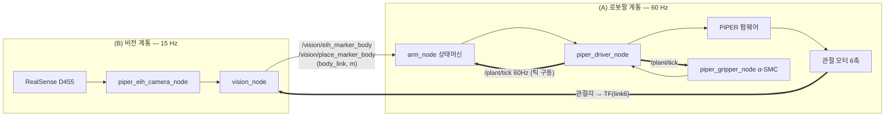
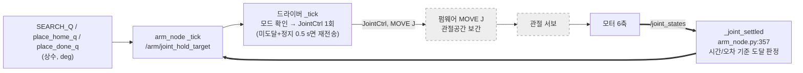
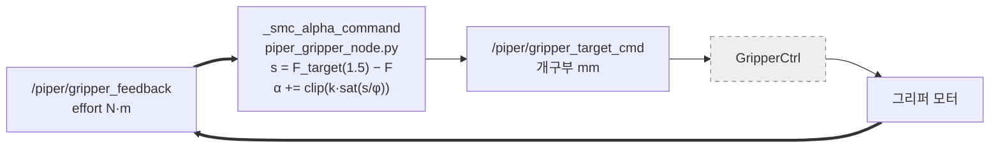
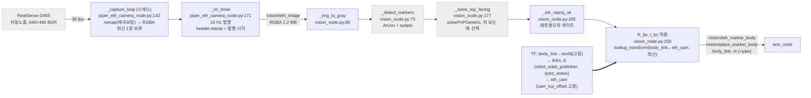

# 블록선도 — PiPER 실기 pick&place (A단계 분석)

> 목적: 신호가 어디서 계산되고 어디서 지연·불확실성이 들어오는지 보이게 그려서,
> **슬라이딩 모드(SMC)를 넣을 지점 / adaptive로 바꿀 지점**을 측정 데이터로 고른다.
>
> - 측정: 2026-10-01, 베이스 고정, 밝은 실내 조명(영상 평균 밝기 106/255), `move_spd_rate_ctrl=5`
> - 데이터: `logs/20261001_103449_bright/`(타이밍 CSV), `logs/bags/20261001_104154_bright`,
>   `logs/bags/20261001_110235_foldstart`(bag) — 그래프는 각 bag의 `plots/`
> - 조도별(어두움/역광) 비교는 검출 대상을 ArUco → 실제 물체(Roboflow 모델)로 바꾼 뒤 수행한다.
> - 라인 번호는 커밋 `루프 타이밍 계측 + …` 기준.

범례

| 표시 | 의미 |
|---|---|
| 흰 블록 | 우리 코드가 계산하는 부분 |
| 회색 점선 블록 | 펌웨어/라이브러리 **블랙박스** (내부 계산을 볼 수도 바꿀 수도 없음) |
| 실선 화살표 | 신호(토픽/함수 호출) |
| 굵은 화살표 `==>` | 피드백(폐루프로 돌아오는 경로) |
| `⏱` | 측정값 (mean / p95 / max) |

---

## 1. 전체 구성 (계통 2개 + 연결점)

두 계통의 연결점은 두 곳이다.

1. **비전 → 팔**: 마커의 body_link 좌표가 arm_node의 목표점(`ml_target`)을 바꾼다.
2. **팔 → 비전**: 카메라가 팔 끝(link6)에 달려 있어서, 카메라→몸체 변환이 **팔의 현재 관절각**에 의존한다.
   (팔이 움직이는 동안의 비전 결과에는 팔 상태 오차가 섞인다 → 4.3절)

---

## 2. (A) 로봇팔 계통

### 2.1 직교 단계 (hover, pre, grasp, lift, place_hover, place_descend, place_retreat …)

```mermaid
flowchart LR
  classDef bb fill:#eee,stroke:#888,stroke-dasharray:5 5,color:#333

  OBJ["물체 기대위치<br/>obj_expected_*<br/>(launch 파라미터)"] --> SM
  EIH["/vision/eih_marker_body<br/>15 Hz, body_link"] --> GP["_grasp_point / _eih_accept<br/>arm_node.py:406, 670<br/>마커→파지점, 점프 게이트"]
  GP -- "ml_target 갱신<br/>(검출될 때만, 15 Hz)" --> SM

  SM["상태머신 _tick<br/>arm_node.py:698<br/>60 Hz (/plant/tick 구동)"] --> ML["_move_l(speed)<br/>arm_node.py:1055<br/>3틱마다(20 Hz) 목표점을<br/>EE_SPEED로 정속 전진<br/>가감속 없음"]
  ML -- "/arm/cartesian_target<br/>20 Hz, body_link xyz [m]" --> CT["_on_cart_target + _tick<br/>piper_driver_node.py:186, 207<br/>body→native 90° 회전<br/>자세 rpy = phase별 고정값"]
  CT -- "EndPoseCtrl(x,y,z,rx,ry,rz)<br/>MOVE L, 값이 바뀐 경우만 송신" --> FWL

  subgraph FW["PiPER 펌웨어 (S-V1.7-3)"]
    FWL["MOVE L 궤적계획<br/>새 목표마다 재계획<br/>속도 = move_spd 5%"]:::bb --> IK["IK<br/>(EE 6D → 관절각)"]:::bb --> JL["관절 서보<br/>(위치/속도 루프)"]:::bb
  end
  JL --> M["모터 6축"]
  M == "GetArmEndPoseMsgs<br/>(펌웨어 FK)" ==> FB["_publish_feedback<br/>piper_driver_node.py:287<br/>60 Hz"]
  M == "GetArmJointMsgs<br/>GetArmHighSpdInfoMsgs" ==> FB
  FB == "/arm/ee_pose_body" ==> ARR["_wait_physical_arrive<br/>arm_node.py:453<br/>도달 판정만 (tol 10 mm / grasp 4 mm)"]
  ARR == "phase 전이만 결정<br/>(목표 보정에는 안 쓰임)" ==> SM
```

| 블록 | 입력 | 처리 | 출력 | 주기 | 단위·좌표계 |
|---|---|---|---|---|---|
| `_grasp_point` / `_eih_accept` (arm_node.py:406, 670) | 마커 위치 | 파지점 = 마커 − 그리퍼 길이·깊이 보정, anchor 대비 XY ≤120 mm·z +30/−50 mm 게이트 | `ml_target`, `ml_grasp` | 검출 시(≤15 Hz) | m, body_link |
| 상태머신 `_tick` (arm_node.py:698) | `/plant/tick`, 각종 콜백 | phase 전이, 단계별 목표 선택 | phase, `_move_l` 호출 | 60 Hz | — |
| `_move_l` (arm_node.py:1055) | `ml_start`, `ml_target`, speed | 현 위치에서 목표로 `speed × 3/60 s`씩 직선 전진 | `/arm/cartesian_target` | 20 Hz | m, body_link |
| 드라이버 `_tick` (piper_driver_node.py:207) | 목표점, phase, 펌웨어 상태 | body→native 회전, phase별 rpy 부착, 모드 확인 후 송신, 중복 생략 | `EndPoseCtrl` (0.001 mm / 0.001°) | 60 Hz 루프, 실제 송신 ≤20 Hz | native(팔 베이스) |
| **펌웨어 MOVE L / IK / 서보** | EndPose 6D | 궤적계획·IK·관절 서보 | 모터 토크 | 내부(비공개) | — |
| `_publish_feedback` (piper_driver_node.py:287) | 펌웨어 FK, 관절각, 속도, 토크 | 단위 변환, native→body | `/arm/ee_pose_body`, `/joint_states`(pos/vel/effort) | 60 Hz | m, rad, rad/s, N·m |
| `_wait_physical_arrive` (arm_node.py:453) | EE 실측, `ml_target` | 거리 ≤ tol이면 다음 phase | phase 전이 | 60 Hz | m |

**폐루프 / 개루프 구분**

- EE 위치의 폐루프는 **펌웨어 안에만** 있다(IK→관절 서보). 우리 코드 쪽은
  `/arm/ee_pose_body`를 **도달 판정에만** 쓰고 목표 보정에는 쓰지 않는다 → **우리 쪽 EE 제어는 개루프**.
- 비전 재검출(pre, grasp, place_descend)은 **물체 위치**에 대한 외부 루프다. EE 오차를 닫는 루프가 아니다.
- 자세(rx, ry, rz)는 phase별 상수(`_rpy_by_phase`)라 **위치 3자유도만** 지령된다.

### 2.2 관절 단계 (wait, place_ready, place_home, place_done)

명령을 **한 번** 보내고 펌웨어가 관절공간에서 혼자 보간한다. 우리 쪽 계산은 상수 선택뿐이다.

### 2.3 그리퍼 (유지 대상 — 참고)

우리 코드 안에서 **유일하게 닫힌 힘 루프**이고, 이미 α-SMC다. 바꾸지 않는다.

### 2.4 팔 계통 측정값

| 항목 | 값 | 출처 |
|---|---|---|
| driver `_tick` 주기 | 59.92 Hz, 간격 std 2.0 ms, 25 ms 초과 0.46 % | 타이밍 CSV |
| driver `_tick` 소요 | 2.3 / 5.2 / 20.4 ms (feedback 1.9, status 0.1, cmd 0.3) | 〃 |
| arm `_tick` 소요 | 0.8 / 1.9 / 12.1 ms | 〃 |
| `/plant/tick` driver→arm 지연 | 2.1 / 5.9 / 33 ms, 유실 0 | 〃 (tick 번호 매칭) |
| 실제 MOVE L 송신 | hover 18.6 s 중 **처음 3.5 s만** 송신(71회), 이후 15 s는 도달 대기 | 〃 |
| 지령 vs 실측 EE 오차 | 최대 313 mm(hover), **575 mm**(place_hover) | bag |
| EE 실속도 | 목표 갱신 중 **12~13 mm/s** / 목표 정지 후 **21 mm/s** | bag |
| phase 종료 시 EE 오차 | hover·lift·place_hover 8~10 mm(= tol 10 mm), grasp 0.5~2 mm, place_descend 0.4~0.8 mm | bag |
| 관절 속도 요동/속도 (J2, J3) | MOVE J 0.30 / 0.45 · MOVE L 1회 0.49 / 0.62 · **MOVE L 스트리밍 0.91 / 1.17** | bag, 0.25 s 고역 성분 |
| velocity 피드백 축 | 관절축 (위치 미분 대비 비 0.87~0.89) | bag |

---

## 3. (B) 비전 계통

| 블록 | 입력 | 처리 | 출력 | 주기 | 단위·좌표계 |
|---|---|---|---|---|---|
| `_capture_loop` (camera:142) | D455 컬러 프레임 | 왜곡보정 remap, BGR→RGBA | 최신 프레임 | 30 fps | px |
| `_on_timer` (camera:171) | 최신 프레임 | ROS Image 생성·발행 | `/vision/eih_image` | 15 Hz | px, stamp=발행 시각 |
| `_img_to_gray` (vision:80) | RGBA | 흑백 변환 | gray | 15 Hz | px |
| `_detect_markers` (vision:73) | gray | ArUco 검출 + 코너 정밀화 (**OpenCV 블랙박스**) | 코너, ID | 15 Hz | px |
| `_solve_top_facing` (vision:177) | 코너, K | solvePnP (**OpenCV**), 위쪽 해 선택 | 마커 위치 (카메라) | 15 Hz | m, eih_cam |
| `_eih_reproj_ok` (vision:205) | 코너, 재투영오차 | px 절대·마커 크기 대비 비율 게이트 | 통과/기각 | 15 Hz | px |
| TF 적용 (vision:258) | 마커(카메라), TF | `R_bc·p + t_bc` | 마커 위치 (몸체) | 15 Hz | m, body_link |

### 3.1 비전 계통 측정값 (밝음)

| 항목 | 값 |
|---|---|
| 카메라 캡처 | 29.97 fps, 간격 std 2.3 ms, 같은 프레임 재발행 0건 |
| 캡처 → 발행 | 22 / 36 / 46 ms (30 fps 캡처를 15 Hz로 샘플링해 0~33 ms 균일 + 처리) |
| 발행 소요 (RGBA 직렬화) | 4.1 / 5.8 / 13 ms |
| stamp → 비전 처리 완료 | 30 / 42 / 64 ms (그중 전송 ≈ 10 ms) |
| 비전 콜백 소요 | 19.8 / 27.4 / 40.9 ms — detect 9.2, gray 5.2, tf 1.4, place 0.9, PnP+게이트 0.8 |
| **프레임 나이 (캡처 → 마커 좌표 산출)** | **평균 ≈ 52 ms** |
| 픽 마커 검출률 | hover 96 %, pre·grasp 100 %, 전체 71 % (place 쪽 자세에선 안 보이는 게 정상) |
| place 마커 검출률 | place_detect **1 %**(178장 중 ≈2장, 11.9 s 소요), place_descend 49 % |

---

## 4. 지연·불확실성이 들어오는 지점

| # | 위치 | 크기 | 영향 |
|---|---|---|---|
| 4.1 | **펌웨어 MOVE L 재계획** (2.1) | 목표 갱신마다 가속 재시작 | EE 속도 −40 %, 위치 계단형, 관절 속도 요동 MOVE J의 2~3배 |
| 4.2 | **지령 궤적 ↔ 실제 팔 분리** (`_move_l` vs 펌웨어 속도) | 지령이 최대 575 mm 앞서감 | 우리 쪽 속도 프로파일이 무의미. 실제 궤적은 펌웨어가 정함 |
| 4.3 | **비전 TF 시점 불일치** (vision:258) | 프레임 나이 ≈52 ms, TF는 "최신" 관절각 | 팔 이동 중(≈20 mm/s) 검출 시 ≈1 mm, MOVE J 속도(≈63 mm/s)면 ≈3 mm 편향. 베이스 이동 시 커짐 |
| 4.4 | 비전 갱신(15 Hz) ↔ 목표 갱신(20 Hz) 엇박 | 검출 시에만 `ml_target`이 튐 | 진동 비교상 비전 연동/무관 구간 차이 없음 → **현재는 주원인 아님** |
| 4.5 | 고정 오프셋 (`ee_grip_offset` 121 mm, `cam_tcp_offset_*`) | 손으로 잰 상수 | 파지점·검출 좌표에 그대로 바이어스로 들어감 |
| 4.6 | 펌웨어 모드 전환 중 명령 유실 | 첫 명령 소실 → 0x4 fault | **수정 완료**(모드 피드백 확인 후 송신, 정지 시 재전송) |

---

## 5. SMC / adaptive 후보 지점

| 후보 | 지점 | 근거(측정) | 전제 |
|---|---|---|---|
| **S1. 관절 추종 SMC** (최우선) | 2.1의 펌웨어 MOVE L/IK/서보 블랙박스를 **우리 IK + 관절 목표 스트리밍**으로 대체한 뒤, 관절 추종 오차 `e = q_ref − q`에 슬라이딩면 `s = ė + λe` | 4.1·4.2: 진동·끊김의 주원인이 펌웨어 재계획. 블랙박스 안에서는 SMC를 넣을 자리가 없음. 관절 속도·토크 피드백(관절축 확인)이 이미 60 Hz로 나옴 | ① FK 검증(URDF vs 펌웨어 EndPose) ② 관절 목표를 계속 바꿔 보내도 펌웨어가 재계획 없이 따라가는지 — 아니면 MIT 모드(0xAD)로 직접 토크/임피던스 지령 |
| **S2. EE 외부 루프 SMC** | 2.1의 `_wait_physical_arrive` 자리 — 지금 개루프인 EE 위치 오차(`/arm/ee_pose_body` − 목표)를 목표 보정에 되먹임 | 4.2: phase 종료 오차가 tol(10 mm)에서 결정됨, grasp도 0.5~2 mm 편차 | S1 이후. IK·모델 오차에 강인한 외부 루프 |
| **A1. 오프셋 adaptive 추정** | 4.5의 `ee_grip_offset`, `cam_tcp_offset` | 손으로 맞춘 상수가 파지·놓기 정밀도의 바이어스. 반복 파지 오차로 온라인 추정 가능 | 반복 실험 데이터(B단계 웨이포인트 + 정답 위치) |
| **A2. 지연 보상(adaptive)** | 4.3의 비전 TF 적용 — 캡처 시점의 관절각으로 TF를 풀거나 지연을 추정해 예측 | 프레임 나이 52 ms, 이동 중 편향 1~3 mm | 이미지 캡처 시각을 stamp로 넘겨야 함(현재 발행 시각). 베이스 이동 단계에서 중요 |
| (유지) 그리퍼 α-SMC | 2.3 | 이미 동작 | 변경 없음 |

**제안 순서**: S1의 전제 두 가지(FK 검증, 관절 스트리밍 거동)를 비전 없이 먼저 확인 → S1 → S2 → A1. A2는 베이스 이동 단계에서.

---

## 6. 발견한 문제점 Top 3

1. **펌웨어 MOVE L 20 Hz 스트리밍이 끊김·진동을 만든다.** 목표 갱신 중 EE 속도 12~13 mm/s(정지 후 21 mm/s), 위치 계단형, 관절 속도 요동 MOVE J의 2~3배. 비전 주기와는 무관(비전 연동/무관 구간 동일).
2. **우리 쪽 궤적과 실제 팔이 따로 움직인다.** 지령이 최대 575 mm 앞서가고, 실제 속도·경로는 펌웨어가 정한다. 우리 코드는 EE 오차를 도달 판정에만 쓰는 개루프다.
3. **블랙박스 경계에서의 명령 유실·오동작.** 모드 전환 중 첫 명령 소실(→ 접힌 자세에서 0x4 fault), phase 전환 시 이전 목표 재송신(→ place_hover에서 손목 회전 후 fault). 둘 다 수정·실기 확인 완료.
