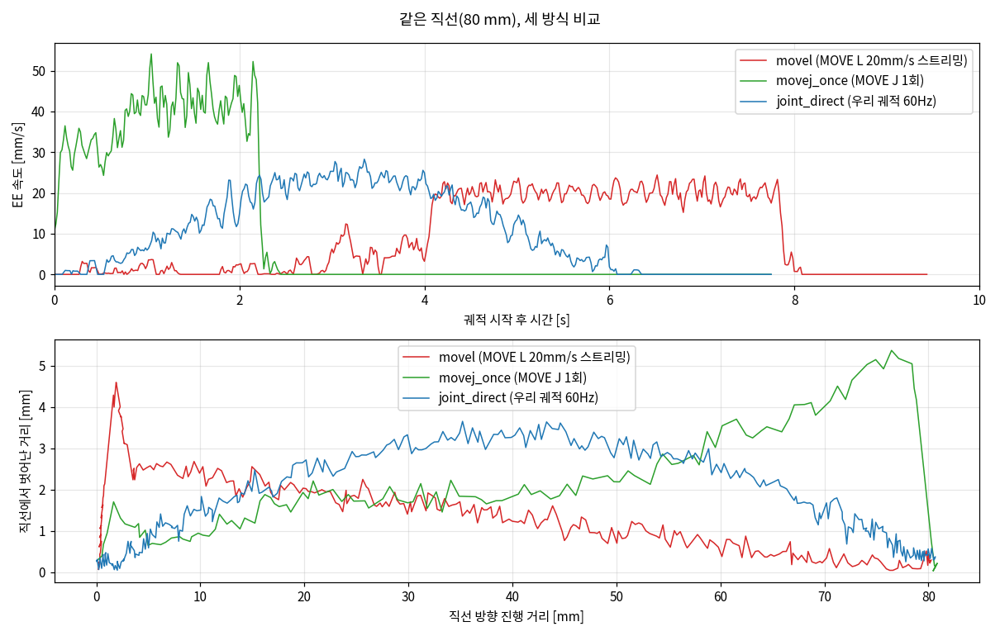
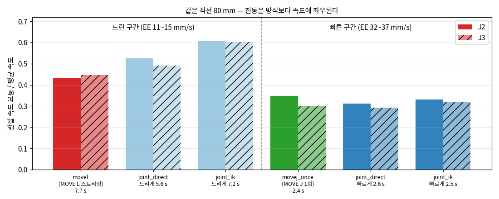
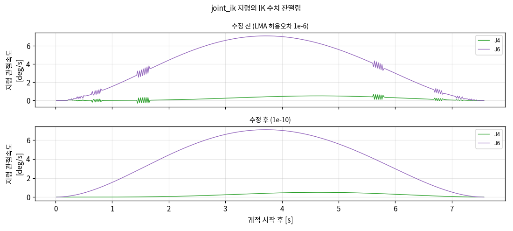

# B단계 중간 결과 — 자체 IK + 관절 스트리밍 (팔만, 비전 없음)

2026-10-06 · 베이스 고정 · `move_spd_rate_ctrl=5` · 웨이포인트 세트 `line`(직선 80 mm, 높이 4 cm·yaw 30°·pitch 5° 변화)

**요약.** 궤적과 IK를 우리가 계산하고 펌웨어에는 관절 목표만 60 Hz로 보내는 방식이 실기에서 동작한다.
A단계의 "뚝뚝 끊김"(MOVE L 재계획)은 이 방식으로 사라졌고, 계획 경로를 0.6~0.7 mm 이내로 따라간다.
남은 잔떨림은 **명령 방식이 아니라 속도**에 좌우된다 — 같은 속도에서는 펌웨어 MOVE J 1회 송신과 같은 수준이고,
느릴수록 상대 진동이 커진다(저속 마찰 영역). 정밀 접근은 느릴 수밖에 없으므로, 이 잔떨림은 위치 지령으로는
더 줄일 수 없고 **MIT 모드 + SMC(관절 토크 제어)**가 다룰 대상이다.

---

## 1. 검증된 전제

| 항목 | 결과 | 근거 |
|---|---|---|
| FK 위치 (URDF link6 vs 펌웨어 EndPose) | 평균 0.1 mm, 최대 1.0 mm | 기존 bag 17,247쌍 |
| FK 자세 (rx, ry, rz) | 정지 0.07 mm / 0.003° | `fk_check` 모드 28 s |
| IK 왕복 | 무작위 200자세 전부 수렴, 최대 0.0007 mm, 0.16 ms/회 | `piper_kin.py` |
| 관절 목표 60 Hz 스트리밍 | 펌웨어가 재계획 없이 따라감, 추종 지연 67 ms | `joint_direct` 실기 |

## 2. 구현 (모두 기존 pick&place 동작은 그대로)

| 파일 | 내용 |
|---|---|
| `common_pkg/piper_kin.py` | URDF(xacro) → PyKDL FK/IK, native↔body 변환 |
| `control_pkg/traj_test_node.py` | 테스트 하네스: 웨이포인트 YAML 실행, dry-run 기본, 계획 검사(IK·관절 한계·틱당 0.6°), 시작점 MOVE J → Enter 승인 → 실행 → 도착 확인 → 자동 종료 |
| `control_pkg/config/traj_waypoints.yaml` | 직선·호·S자·1축(y) 세트 — J5 한계 15° 이상 여유, 손끝이 테이블보다 10 cm 이상 위 |
| `piper_hw_pkg/launch/traj_test.launch.py` | 드라이버 + robot_state_publisher + 하네스만 (비전·arm_node·그리퍼 없음) |
| `piper_driver_node.py` | 테스트 phase `traj_joint`/`traj_cart`, `initial_phase`(테스트는 `idle`), `/arm/ee_pose_native` 발행 |
| `tools/traj_analyze.py` | 추종 지연, 경로 오차, 진동, 도착, FK 대조 + 그래프 |

하네스 모드: `joint_direct`(웨이포인트만 IK, 관절공간 보간) · `joint_ik`(직교 경로 + 매 틱 IK) ·
`movel`(기존 방식 기준선) · `movej_once`(끝점 MOVE J 1회 기준선) · `fk_check`

## 3. 같은 직선에서의 비교

위: EE 속도. `movel`(빨강)은 목표를 흘려보내는 처음 4 s 동안 멈췄다 가기를 반복(A단계 끊김 재현)하고, 송신이 끝난
뒤에야 20 mm/s로 간다. `joint_direct`(파랑)는 계획한 최소저크 종 모양을 그대로 따른다.
아래: 직선에서 벗어난 거리. `joint_direct`의 휘어짐은 관절공간 보간이라 계획 자체가 그렇다(계획 대비 0.56 mm).
진짜 직선은 `joint_ik`가 낸다(계획 대비 0.70 mm).

| 방식 | 이동 시간 | EE 평균 속도 | 관절 진동 J2/J3 | 추종 지연 | 계획 경로 대비 최대 오차 | 끝점 오차 |
|---|---|---|---|---|---|---|
| movel (MOVE L 20 mm/s 스트리밍) | 7.7 s (계획 4.0) | 11 mm/s | 0.43 / 0.45 | — | 4.6 mm | 0.27 mm |
| joint_direct 느리게 | 5.6 s | 15 mm/s | 0.53 / 0.49 | 67 ms | 0.56 mm | 0.34 mm |
| joint_ik 느리게 | 7.2 s | 14 mm/s | 0.61 / 0.60 | 67 ms | 0.70 mm | 0.07 mm |
| movej_once (MOVE J 1회) | 2.4 s | 35 mm/s | 0.35 / 0.30 | — | 6.0 mm | 0.16 mm |
| joint_direct 빠르게 | 2.6 s | 32 mm/s | 0.31 / 0.29 | 317 ms | 5.3 mm | 0.12 mm |
| joint_ik 빠르게 | 2.5 s | 36 mm/s | 0.33 / 0.32 | 317 ms | 6.4 mm | 0.23 mm |

진동 지표: 관절 속도에서 0.25 s 이동평균을 뺀 성분(≈4 Hz 이상)의 RMS ÷ 평균 속도 — A단계와 동일.
**이 지표는 0.5~1 s 주기의 "멈췄다 가기" 끊김은 잡지 못한다.** `movel`이 느린 구간에서 낮게 나온 것은 움직임의
대부분이 송신 종료 후 MOVE L 1회 구간이었기 때문이고, 끊김은 위 속도 그래프로 본다.

## 4. 발견

1. **A단계 끊김의 원인은 명령 방식(MOVE L 재계획)이었고, 관절 스트리밍으로 해결됐다.** 비전 주기와는 무관 —
   이번 실험은 비전 없이 수행했다.
2. **같은 속도에서는 우리 궤적 스트리밍 ≈ 펌웨어 MOVE J 1회.** 진동 0.31~0.33 vs 0.35, EE 떨림 0.41~0.43 vs 0.51 mm.
3. **느릴수록 상대 진동이 커진다** (같은 `joint_direct`에서 0.31 → 0.53). 저속 마찰(stick-slip) 영역으로 보인다.
   빠르면 상대 진동은 줄지만 EE 떨림 절대값(0.21 → 0.43 mm)과 경로 오차는 커진다.
4. **펌웨어 속도 상한 5%가 빠른 궤적을 막는다.** 빠른 실행에서 지연 67 → 317 ms, 경로 오차 0.6 → 5~6 mm.
5. **매 틱 IK의 수치 잔떨림** — LMA 허용오차 1e-6에서 J4·J6 지령이 틱마다 흔들렸다(가속도 RMS 8~11 deg/s²).
   1e-10으로 조여 해결(0.2~2.1 deg/s², `joint_direct` 수준). 실측 손목 J5 가속 요동 16.1 → 11.8.
6. **펌웨어 "고속 추종" 모드(`MotionCtrl_2(..., MOVE J, ..., 0xAD)`)는 기각** (E1, 14:09). 5 % 속도 상한을 우회하려고
   시험했으나 두 가지 문제가 있었다.
   - **진입 순간 튐** — Enable 직후 플래그를 보낸 0.2~0.3 s 사이, 지령은 현재 자세 그대로(변화 ≤0.01°)인데
     J3가 −18°, J5가 +5° 꺾였다가 0.5 s 안에 복귀했다. 관절 속도 최대 J5 9 rad/s, J3 토크 7.2 N·m(MIT 상한 ±8 근접).
     같은 조건의 일반 모드는 Enable 처짐 J2 1.3°뿐이었다.
   - **진입 후 정확도 저하** — 멈춘 뒤 관절 오차 0.39°(일반 0.04°), 끝점 3.5 mm를 20 s 동안 못 채움.
     적분·중력 보상 없는 펌웨어 고정 게인 PD와 비슷한 거동으로 보인다(내부 확인 불가).
   - **튐 이후 모터 자체 비활성** — 2번 종료(14:10) 뒤 6축이 꺼져 있었고(상태 코드·모터 에러 비트는 정상), 14:16 재실행 때
     Enable 1 s 만에 다시 꺼졌다. `clear_arm_fault.py`(복구 명령) 후 정상. 튐의 큰 토크·속도로 모터 드라이버 보호가 걸려
     펌웨어 안에 잠겨 있던 것으로 보인다. → 드라이버에 **모터 Enable 감시**를 넣었다(0.5 s 이상 꺼지면 오류 후 명령 중단,
     복귀하면 재송신, 저속 피드백이 끊기면 판단 보류).
   - 정확도 문제는 튐을 피해도 남으므로 이 모드는 쓰지 않는다(드라이버 옵션 제거). **MIT 모드 진입 절차 설계의 근거**로
     남긴다: Enable과 모드 전환을 분리하고, 6축 "현재 위치 유지" 명령을 먼저 깔고, 게인·토크 상한을 낮게 시작한다.
7. **시작점 이동도 스트리밍으로 바꿨다** (14:08). 한 번에 큰 관절 목표를 보내던 방식 대신 현재 자세 → 시작점 최소저크
   (관절 최고 0.15 rad/s, 틱당 0.6° 클램프)로 보낸다. 실기에서 첫 지령 = 현재 자세, 시작점 오차 0.06°, 끝점 0.31 mm.
8. **펌웨어 속도 상한(`move_spd_rate_ctrl`)을 올리면 빠른 궤적 문제가 풀리지만, 저속 잔떨림은 그대로다** (14:19~14:23).

   | `joint_ik` 같은 직선 | 상한 | 추종 지연 | 계획 경로 대비 최대 오차 | 진동 J2/J3 |
   |---|---|---|---|---|
   | 빠르게 (2.4 s) | 5 % | 317 ms | 6.3 mm | 0.37/0.32 |
   | 빠르게 | **10 %** | **83 ms** | **0.62 mm** | **0.24/0.20** |
   | 빠르게 | 20 % | 83 ms | 0.62 mm | 0.24/0.18 |
   | 느리게 (7.6 s) | 5 % | 67 ms | 0.52~0.72 mm | 0.61/0.58 |
   | 느리게 | 20 % | 67 ms | 0.62 mm | 0.64/0.58 |

   빠른 동작의 지연은 5 % 상한 때문이었고 10 %면 충분하다(속도 상한은 우리 궤적·틱당 클램프가 지킨다).
   **느린 동작의 잔떨림은 상한을 4배로 올려도 변하지 않았다** — 명령 방식·송신 주기·IK·속도 상한을 모두 바꿔도 남는
   저속 마찰·서보 문제로 확정. MIT 모드 + SMC의 근거.

## 5. 채택 방식 — `joint_ik`

**`joint_ik`를 채택한다.** 우리가 EE 궤적(최소저크)을 만들고, 매 틱 IK로 관절각을 계산해서, 펌웨어에 관절 목표를
60 Hz로 흘려보내는 방식이다. 느린 실행과 빠른 실행은 같은 방식이고 `v_max`(속도)만 다르다.

같은 직선 80 mm를 오전과 촬영 때(오후) 두 번 돌렸고, 결과가 재현됐다. 촬영 때 `movej_once` 1건은 시작점 이동 중
중단돼 궤적 데이터가 없어 제외했다.

| # | 방식 | 관절 진동 J2/J3 (오전 → 촬영 때) | 계획 경로 대비 오차 | 움직이는 목표 추종 | 판정 |
|---|---|---|---|---|---|
| 1 | `movel` — 기존 MOVE L 스트리밍 | 0.43/0.45 → 0.39/0.41 | 1.1~4.6 mm | 가능하지만 **멈췄다 가기** 반복 | ✗ A단계 문제 그 자체 |
| 2 | `joint_direct` — 관절공간 보간 | 0.53/0.49 → 0.54/0.52 | 0.6 mm | ✗ 경로가 직선이 아니고 사전 계획만 | 실험용 (펌웨어 거동 검증) |
| 3 | **`joint_ik` 느리게** | 0.61/0.60 → 0.61/0.58 | **0.5~0.7 mm** | **가능** (매 틱 목표 지정) | **채택** |
| 4 | `movej_once` — MOVE J 1회 | 0.35/0.30 → 0.36/0.31 | 6.0 mm | ✗ 끝점만 주고 경로 제어 없음 | 기준선 |
| 5 | **`joint_ik` 빠르게** | 0.33/0.32 → 0.37/0.32 | 6.3~6.4 mm (펌웨어 5 % 상한) | 가능 | **채택** (속도만 다름) |

**채택 이유**

1. **요구 조건 세 가지를 모두 만족하는 유일한 방식이다.** pick&place에는 경로 제어(파지 직전 수직 하강 같은 직선),
   실시간 추종(타겟이 움직이면 따라가기), 끊김 없는 동작이 필요하다. `movel`은 끊기고, `joint_direct`는 경로가 직선이
   아니며, `movej_once`는 경로도 추종도 없다.
2. **A단계 끊김을 해결했다.** 펌웨어가 목표마다 재계획하던 MOVE L을 쓰지 않으므로 멈췄다 가기가 사라졌다
   (3절 속도 그래프, 촬영 영상 1번 vs 3번).
3. **정확하다.** 느린 속도에서 계획 경로를 0.5~0.7 mm 이내로 따라가고, 끝점 오차는 0.26 mm다.
4. **진동은 다른 방식과 같은 수준이다.** 같은 속도끼리 비교하면 펌웨어 MOVE J 1회와 같다(5번 0.37/0.32 vs 4번
   0.36/0.31). 4번이 영상에서 덜 떨려 보이는 것은 3배 빠르기 때문이다.
5. **SMC로 이어지는 구조다.** 이 궤적과 IK가 그대로 SMC의 기준 신호가 되고, 다음 단계(MIT 모드)에서는 펌웨어 서보
   대신 우리 제어기가 이 기준을 따라간다.

**채택했지만 남은 한계**

- **저속 잔떨림** — 느릴 때 상대 진동이 0.6으로 빠를 때(0.33~0.37)보다 크다. 위치 명령 방식으로는 다섯 방식 모두
  같은 경향이라 명령으로는 더 줄일 수 없다. → MIT 모드 + SMC가 다룰 대상.
- **빠른 동작의 지연** — 펌웨어 5 % 속도 상한 때문에 빠르게 돌리면 지연 317 ms, 경로 오차 6 mm가 생긴다.
  고속 추종 모드(E1)는 기각됐다(4절 6번). 일반 모드에서 상한을 10 %로 올려 해결했다(4절 8번: 83 ms, 0.62 mm).
- **실시간 재계획은 아직이다.** 지금은 정해진 웨이포인트를 실행하는 단계이고, 실행 중 목표가 바뀌는 기능은
  MIT 단계 이후에 얹는다.

## 6. 다음 단계

| 순서 | 내용 | 목적 |
|---|---|---|
| 1 | **온라인 재계획**: 목표가 바뀌면 현재 위치·속도에서 이어지는 궤적 + 미분 IK | 실시간 추종 pick&place의 핵심. 비전 없이 "실행 중 목표 이동" 테스트로 검증 |
| 2 | ~~펌웨어 속도 상한 조정~~ → **완료**: 10 %로 빠른 궤적 해결, 저속 잔떨림은 무관 (4절 8번) | 고속 추종 모드(0xAD)는 기각 |
| 3 | 세트별(호·S자·1축) × 방식별 5회 반복 | 통계·레이저 변위계 실험 준비 |
| 4 | **MIT 모드 + SMC** 조사·설계 (중력 보상, 루프 주기, 안전, **진입 절차** — 4절 6번 튐 근거). 첫 실험 기록: [MIT_E2_LOG.md](MIT_E2_LOG.md) | 저속 잔떨림 = 관절 제어 대상. 위 1~3의 궤적·IK는 그대로 기준 신호로 재사용 |

## 데이터

`logs/traj/20261006_*` (git 제외; 오전 10:16~10:53, 촬영 때 11:28~11:34, E1 14:08~14:10, 속도 상한 14:19~14:23) — 각 실행의 `traj.csv`(지령·실측 관절, 속도, 토크, 펌웨어 EE 6D, FK 대조),
`traj_plot.png`. 분석: `python3 tools/traj_analyze.py logs/traj/<run> [...]`
