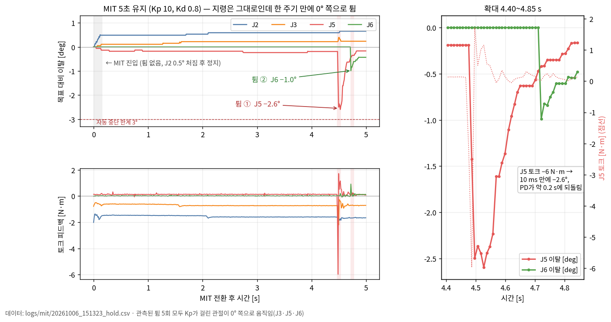

# E2 — MIT 모드 첫 실험 기록

2026-10-06 · 베이스 고정 · 비전 없음 · 도구 `tools/mit_probe.py`

**요약.** MIT 모드(MOVE M + 0xAD) **진입은 튐 없이 성공**했다. 그러나 유지 중 수 초에 한 번, Kp가 걸린 관절이
**0° 쪽으로 순간적으로 끌려가는 튐**이 5회 관측됐다. 우리 쪽(루프 타이밍, CAN 송신, 스레드 충돌, 프레임 인코딩)은
원인에서 배제했고, 남은 가설은 **펌웨어가 가끔 한 관절의 목표 위치를 0으로 처리한다**는 것이다. 이를 가리는 실험
(펌웨어 Kp = 0, 위치 복원은 우리 루프가 τ_ff로)은 준비만 하고, 실행 직전 USB-CAN 어댑터가 멈춰 다음으로 넘겼다.

배경: [B_STAGE_INTERIM.md](B_STAGE_INTERIM.md) 4절 6번(고속 추종 모드 튐), 제안서의 진입 절차 설계.

---

## 1. 도구와 절차 (`tools/mit_probe.py`)

드라이버(ROS) 없이 SDK로 직접 제어한다. 기본은 dry-run(명령 없음), `--go`일 때만 송신.

| 단계 | 내용 |
|---|---|
| 전제 | 팔이 위치 모드(CAN 제어)로 Enable, 상태 정상. 드라이버 프로세스가 없어야 함 |
| 정지 확인 2 s | 위치 모드로 현재 자세 유지 지령, 이탈 0.5° 이하·속도 0.2 rad/s 이하 |
| 유지 토크 측정 0.5 s | 실측 effort 평균 → τ_ff(중력 보상 근사), ±3 N·m 클리핑 |
| MIT 전환 | `MotionCtrl_2(0x01, 0x04, 0, 0xAD)` **1회** → 즉시 6축 `JointMitCtrl(q_ref=유지 자세, 0, Kp, Kd, τ_ff)` 100 Hz |
| 감시 | 기준 대비 3° 이탈(즉시), 관절 속도 0.5 rad/s 3주기 연속, 모터 비활성, 상태 이상, 전환 0.2 s 후 모드 피드백 ≠ 4 |
| 종료 | 정상·중단 모두 `MotionCtrl_1(0x01)` 비상 정지(천천히 내려앉음) → `clear_arm_fault.py`로 복구 |

옵션: `--stage hold|sine`(J6 사인파), `--kp/--kd` 관절별, `--ext-kp`(아래 4절), `--fake`(가짜 팔 로직 시험).
CAN 버스는 SDK 생성 직전에 `can.ThreadSafeBus`로 바꿔 끼운다(3절).

## 2. 실기 결과

시작 자세: `traj_test` 직선 끝점 q ≈ (−0.3, 121.0, −73.2, 1.6, 52.0, 13.6)°, 그리퍼 아래 방향. 게인 Kp 10, Kd 0.8(SDK 예제값).

| 시각 | 조건 | 결과 | 순간 튐 |
|---|---|---|---|
| 15:00 | 모드 명령 1 s마다 재전송 | 1.12 s에 중단 (속도) | 1회 — 1.10 s |
| 15:13 | **재전송 제거** | **5 s 정상 종료** | 2회 — 4.48 s, 4.72 s |
| 15:22 | + ThreadSafeBus, 15 s | 1.76 s에 중단 (속도) | 1회 — 1.73 s |
| 15:26 | + J5·J6 Kp 0 | 0.47 s에 중단 (속도) | 1회 — 0.46 s (J3) |

**진입은 성공.** 4회 모두 모드 피드백이 10 ms 안에 MOVE J(1) → MOVE M(4)로 바뀌었고, J2가 0.47–0.61°,
J3가 0.11–0.24° 천천히 처진 뒤 멈췄다(약 160 ms). 0xAD 고속 추종 모드에서 본 진입 튐(J3 −18°)은 없었다.
진입 직전 Enable과 모드 전환을 분리한 절차가 통했다.

**튐 없는 구간은 안정.** 모든 관절 이탈 0.6° 이내, 관절 속도는 잡음 수준(정지 시 피드백 잡음 최대 J6 0.10 rad/s).

### 순간 튐 5회

| # | 실행 | 관절 (목표) | 움직임 | 방향 |
|---|---|---|---|---|
| 1 | 15:00 1.10 s | J6 (13.6°) → J5 (52°) | J6 −1.2° (−1.6 rad/s), 이어 J5 −2.3° (−2.1 rad/s) | 둘 다 **0° 쪽** |
| 2 | 15:13 4.48 s | J5 (52°) | 토크 −2.2 → **−6.0 N·m**, −2.6° 후 PD가 약 0.2 s에 복귀 | **0° 쪽** |
| 3 | 15:13 4.72 s | J6 (13.6°) | 토크 +0.9 N·m, −1.0° | **0° 쪽** |
| 4 | 15:22 1.73 s | J5 (52°) | −2.7° (−2.0 rad/s) | **0° 쪽** |
| 5 | 15:26 0.46 s | J3 (−73.3°) | 토크 −0.5 → **+2.5 N·m**, +1.4° (3.0 rad/s), 반동으로 J5 −1.5° | **0° 쪽** |

공통점: 지령은 변하지 않았는데 한 주기(10 ms) 만에 시작한다. 다섯 번 모두 Kp가 걸린 관절이 0° 쪽으로 끌려갔고,
크기가 "목표 위치가 순간 0이 된 경우" Kp·(0 − q)(J5: 10 × 0.91 ≈ 9 N·m, 상한 8)와 맞는다. 0°에서 먼 관절일수록
세게 튄다.



위 그래프는 15:13 실행(5 s 유지, 튐 2회)이다. 왼쪽 위가 관절별 목표 대비 이탈, 왼쪽 아래가 같은 시간의 토크 피드백,
오른쪽이 4.40–4.85 s 확대다.

- **진입(회색 띠):** 전환 직후 J2가 0.5° 처진 뒤 멈추고, 나머지 관절은 거의 움직이지 않는다. 이후 4 s 이상 이탈이
  0.6° 안에서 유지된다.
- **튐 ①(4.48 s, J5):** 지령은 그대로인데 J5 토크가 한 주기 만에 −6 N·m로 튀고, 10 ms 만에 −2.6°까지 끌려간다.
  펌웨어 PD(Kp 10)가 약 0.2 s에 대부분, 약 0.4 s에 튐 전 위치(−0.2°)까지 되돌린다.
- **튐 ②(4.72 s, J6):** J6가 같은 방식으로 −1.0° 튄다.
- 두 번 모두 **0° 쪽**이고, 자동 중단 한계(3°)에는 닿지 않아 실행은 정상 종료됐다. 같은 패턴이 다른 실행에서도
  반복됐다(위 표).

## 3. 원인 조사 — 배제한 것

| 후보 | 확인 | 결과 |
|---|---|---|
| 모드 명령 재전송 | 1번 튐이 첫 재전송(1.0 s) 0.1 s 뒤 → 재전송 제거 | **튐 계속** (15:13 이후) |
| 우리 루프 지연 | 주기 간격 평균 10.1 ms, 최대 11.6–13 ms, 튐 직전도 10 ms | 배제 |
| CAN 송신 누락 | `ip -s link`: TX errors 0, dropped 0, bus-errors 0 | 배제 |
| SDK 수신 스레드·송신 충돌 | SDK가 잠금 없는 `can.interface.Bus` 사용. 커뮤니티 포크가 `can.ThreadSafeBus`로 "MIT 움찔거림"을 고쳤다고 함 → 적용 | **튐 계속** (15:22) |
| 프레임 인코딩 | `JointMitCtrl` 8바이트 + 4비트 XOR CRC, 위치 16비트(±12.5 rad) — 이상 없음 | 배제 |

남은 가설: **펌웨어(또는 관절 드라이버)가 간헐적으로 한 관절의 MIT 목표 위치를 0으로 처리한다.** 관절과 무관
(J3·J5·J6), 1–5 s에 한 번꼴. 내부를 볼 수 없어 직접 확인은 못 했다.

참고: [Reimagine-Robotics piper_sdk 포크의 ThreadSafeBus 커밋](https://github.com/Reimagine-Robotics/piper_sdk/commit/f0e06ee52ba296799a4e0b6a511fecdcff220fd0),
[pyAgxArm #52 — J1–J3 MIT 게인 내부 스케일 가능성](https://github.com/agilexrobotics/pyAgxArm/issues/52).
ThreadSafeBus는 해가 없어 `mit_probe.py`에 유지한다.

## 4. 다음 실험 — `--ext-kp` (준비 완료, 실기 미실행)

목표 위치가 오염돼도 토크가 생기지 않는 구조:

| | 지금 | `--ext-kp` |
|---|---|---|
| 펌웨어 Kp | 10 | **0** |
| 펌웨어 Kd | 0.8 | 0.8 (빠른 감쇠는 드라이버 유지) |
| 위치 복원 | 펌웨어 | 우리 루프 100 Hz: τ_ff = 중력 + ext_kp·(q_ref − q), ±4 N·m |

가짜 팔(가끔 J3 목표 위치를 0으로 처리)에서: 지금 방식은 J3 1.19 rad/s로 튀어 중단, `--ext-kp 10 …`은 튐 0회로
정상 종료. 실기에서 15 s 동안 튐이 사라지면 가설이 확정되고, 이 구조가 그대로 SMC의 바탕이 된다(SMC도 τ_ff로 토크를 넣음).
단점: 위치 복원이 100 Hz 루프에서 나오고 토크가 0.063 N·m 계단이라 유지가 조금 물렁할 수 있다.

```bash
python3 clear_arm_fault.py
ros2 launch piper_hw_pkg traj_test.launch.py really_enable:=true dry_run:=false set:=line mode:=joint_ik confirm:=false start_delay:=2
python3 tools/mit_probe.py --stage hold --hold 15 --go --ext-kp 10 10 10 10 10 10
```

## 5. 같이 얻은 것

- **토크 단위:** 위치 모드에서 잰 effort를 τ_ff로 넣었더니 J2가 0.5–0.6°만 처지고 버텼다 → MIT 토크 단위는 위치 모드
  effort와 거의 맞는다(J2 기준 차이 약 0.1 N·m). 반면 **MIT 중 effort 피드백은 다르게 읽힌다**(J2 지령 약 −1.8 N·m인데
  피드백 −1.29). MIT 중에는 effort를 실제 토크로 믿지 않는다.
- **정지 판정:** 정지 상태에서도 관절 속도 피드백 잡음이 J4 0.06, J6 0.10 rad/s까지 나온다. 처음 정한 0.02 rad/s 기준은
  통과할 수 없어 0.2 rad/s로 바꿨고, 속도 중단 조건은 3주기 연속으로 디바운스했다.
- **진입 자세 유지 토크** (직선 끝점): J2 −1.6–−2.0, J3 −0.5–−1.0 N·m. 측정할 때마다 0.2–0.3 N·m씩 달라진다(위치 모드
  서보의 정지 마찰·적분 상태로 추정).

## 6. 장비 이슈 — USB-CAN 어댑터 멈춤 (15:33 이후)

| 시각 | 일 |
|---|---|
| 15:33 | Jetson이 예고 없이 재부팅. 직전 부팅 저널이 보관되지 않아 원인은 확인 불가(자동 업데이트는 차단 상태 유지) |
| 15:35 | `clear_arm_fault.py`에서 `SendCanMessage(SEND_MESSAGE_FAILED)` 반복. 출력된 "arm_status NORMAL"은 피드백이 없어 찍힌 기본값 |
| 15:37 | 확인: `can_piper` UP·1 Mbps, 어댑터 매핑 정상(시리얼 일치), 그러나 RX 0프레임·피드백 0 Hz, `candump` 3 s 무수신. 커널 로그 `gs_usb … can_piper: usb xmit fail` 반복, TX dropped 10 |

판단: 팔·케이블이 아니라 **어댑터가 재부팅 뒤 USB 송신이 막힌 상태**. 팔은 전원을 끈 채 마감했다.

복구 절차(다음 시작 시):

1. 팔 전원 켜기(팔은 토크 꺼진 채 켜짐).
2. USB-CAN 어댑터를 뽑았다 다시 꽂기 → udev가 `can_piper`로 이름 붙임.
3. `sudo ip link set can_piper down` → `sudo ip link set can_piper type can bitrate 1000000` → `sudo ip link set can_piper up`
4. `GetArmJointMsgs().Hz`가 200 근처인지 확인. 그래도 0이면 팔 전원 재투입·CAN 케이블 확인.

## 데이터

`logs/mit/20261006_1500*~1526*_hold.csv`(git 제외) — 주기별 q, qd, effort, q_ref, 보낸 τ, arm_status/ctrl_mode/mode_feed,
Enable. `_dry.csv`는 dry-run, `_fake.csv`는 가짜 팔.
